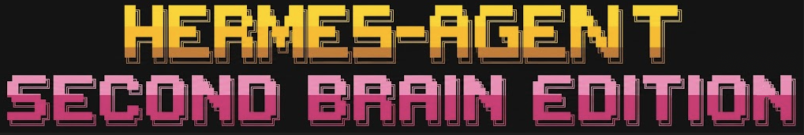

<p align="center">
  
</p>

# Hermes Agent - Second Brain Edition
<p align="center">
  <a href="https://hermes-agent.nousresearch.com/">Hermes Agent</a> | <a href="https://hermes-agent.nousresearch.com/">Hermes Desktop</a>
</p>
<p align="center">
  <a href="https://github.com/ahlfs/hermes-agent"></a>
  <a href="https://github.com/NousResearch/hermes-agent/blob/main/LICENSE"></a>
  <a href="README.md"></a>
  <a href="README.id.md"></a>
  <a href="README.zh-CN.md"></a>
  <a href="README.ur-pk.md"></a>
  <a href="README.es.md"></a>
</p>

> **⚠️ CUSTOM FORK FOR LAM-CYBERLAB**
>
> This repository is a heavily modified version of Hermes Agent by **Ahlfs**. It is specifically designed to be fully compatible as the backend intelligence engine for **[LAM-Cyberlab](https://github.com/ahlfs/LAM-Cyberlab)**. See the [Second Brain Edition](#-second-brain-edition-custom-fork) section below for details on custom features.

**The self-improving AI agent built by [Nous Research](https://nousresearch.com).** It's the only agent with a built-in learning loop — it creates skills from experience, improves them during use, nudges itself to persist knowledge, searches its own past conversations, and builds a deepening model of who you are across sessions. Run it on a $5 VPS, a GPU cluster, or serverless infrastructure that costs nearly nothing when idle. It's not tied to your laptop — talk to it from Telegram while it works on a cloud VM.

Use any model you want — [Nous Portal](https://portal.nousresearch.com), OpenRouter, OpenAI, your own endpoint, and [many others](https://hermes-agent.nousresearch.com/docs/integrations/providers). Switch with `hermes model` — no code changes, no lock-in.

<table>
<tr><td><b>A real terminal interface</b></td><td>Full TUI with multiline editing, slash-command autocomplete, conversation history, interrupt-and-redirect, and streaming tool output.</td></tr>
<tr><td><b>Lives where you do</b></td><td>Telegram, Discord, Slack, WhatsApp, Signal, and CLI — all from a single gateway process. Voice memo transcription, cross-platform conversation continuity.</td></tr>
<tr><td><b>A closed learning loop</b></td><td>Agent-curated memory with periodic nudges. Autonomous skill creation after complex tasks. Skills self-improve during use. FTS5 session search with LLM summarization for cross-session recall. <a href="https://github.com/plastic-labs/honcho">Honcho</a> dialectic user modeling. Compatible with the <a href="https://agentskills.io">agentskills.io</a> open standard.</td></tr>
<tr><td><b>Scheduled automations</b></td><td>Built-in cron scheduler with delivery to any platform. Daily reports, nightly backups, weekly audits — all in natural language, running unattended.</td></tr>
<tr><td><b>Delegates and parallelizes</b></td><td>Spawn isolated subagents for parallel workstreams. Write Python scripts that call tools via RPC, collapsing multi-step pipelines into zero-context-cost turns.</td></tr>
<tr><td><b>Runs anywhere, not just your laptop</b></td><td>Six terminal backends — local, Docker, SSH, Singularity, Modal, and Daytona. Daytona and Modal offer serverless persistence — your agent's environment hibernates when idle and wakes on demand, costing nearly nothing between sessions. Run it on a $5 VPS or a GPU cluster.</td></tr>
<tr><td><b>Research-ready</b></td><td>Batch trajectory generation, trajectory compression for training the next generation of tool-calling models.</td></tr>
</table>

---

## 🧠 Second Brain Edition (Custom Fork)

This is a custom fork of Hermes Agent **modified and maintained by Ahlfs**, featuring an autonomous **Second Brain** pipeline and automated GitHub configuration backups.

### Features
1. **Automated Second Brain Pipeline**
   - **Audio Transcription**: Drops an `.mp3` into `01-Audio` and Hermes automatically transcribes it using Whisper.
   - **Document Parsing**: Parses `.pdf` and performs OCR on images dropped into `02-Documents`.
   - **Wiki Generation**: Synthesizes transcripts and documents into interlinked Wikipedia-style markdown files in `04-Wiki`.
   - **Git Backup**: Automatically commits and pushes new knowledge to a private GitHub repository.
   - **Full Source Cleanup Cascade**: Safely deletes the raw source files (`.mp3`, `.pdf`, etc.) from `01-Audio` and `02-Documents` *only after* the final knowledge has been successfully backed up to GitHub, keeping your vault lean.
2. **Automated Config Backup**
   - Backs up your `~/.hermes` configs, custom skills, and memories to a separate private GitHub repo via a scheduled cron job (default: every 24h).
3. **Dynamic Swarm Router (Intent-Based Routing)**
   - Automatically intercepts and routes incoming messages to the most capable specialist sub-agent (`builder`, `researcher`, `writer`).
   - Uses zero-latency keyword classification to infer user intent, providing a frictionless swarm experience without manual profile switching.
4. **LAM-Cyberlab Native Integration**
   - **Real-time Streaming**: Full support for progressive token streaming via SSE/WebSockets (`stream_events.py`), making it a zero-friction, plug-and-play intelligence backend for the LAM-Cyberlab UI.
   - **Closed-Loop Learning**: Synergizes flawlessly with the native Self-Healing Skill Generator. When faced with complex tasks from the Cyberlab UI, the agent can autonomously write, test, and save its own new `.md` skills for future use.

## Quick Install & Setup

Follow these steps to install the LAM-Cyberlab compatible version of Hermes Agent.

> **⚠️ WINDOWS USERS**: This project heavily relies on Linux packages (like `apt install ffmpeg`) and Bash scripts. Git Bash or native PowerShell will **not** work for the Second Brain pipeline. You **must** install and use **[WSL2 (Windows Subsystem for Linux)](https://learn.microsoft.com/en-us/windows/wsl/install)** to follow these steps.

### 1. Install OS Dependencies
The Second Brain pipeline requires `ffmpeg` (for audio) and `tesseract-ocr` (for images). Run the command appropriate for your system:

**Ubuntu / Debian / WSL2 (Default):**
```bash
sudo apt update && sudo apt install ffmpeg tesseract-ocr
```

**macOS (via Homebrew):**
```bash
brew install ffmpeg tesseract
```

**Fedora / RHEL:**
```bash
sudo dnf install ffmpeg tesseract
```

**Arch Linux:**
```bash
sudo pacman -S ffmpeg tesseract
```

### 2. Install Hermes Base & Swap to Custom Fork
First, use the official installer to set up the necessary runtimes (Node.js, uv, PATH wrapper), then replace the source code with this custom repository.

**Linux / macOS / WSL2:**
```bash
# Install the base environment
curl -fsSL https://hermes-agent.nousresearch.com/install.sh | bash

# Replace official repo with the Ahlfs custom fork
rm -rf ~/.hermes/hermes-agent
git clone https://github.com/ahlfs/hermes-agent.git ~/.hermes/hermes-agent

# Re-sync dependencies
cd ~/.hermes/hermes-agent
~/.hermes/bin/uv pip install -e ".[all]"
```

> **Windows Native:** Run `iex (irm https://hermes-agent.nousresearch.com/install.ps1)` in PowerShell, then delete `%LOCALAPPDATA%\hermes\hermes-agent` and `git clone https://github.com/ahlfs/hermes-agent.git` in its place.

### 3. Initialize Second Brain Environment
Run the setup script to create an isolated virtual environment specifically for the Second Brain tools:
```bash
bash scripts/second-brain/setup-venv.sh
```

### 4. Configure Environment Variables
Open your `~/.hermes/.env` file and add the following settings at the bottom:
```ini
# Directory of your Obsidian Vault (Second Brain)
OBSIDIAN_VAULT_DIR=/home/user/obsidian/memo

# GitHub Backup Settings (Optional: for automated cloud backup)
GITHUB_USERNAME=your_github_username
GITHUB_REPO_CONFIG=hermes-config
GITHUB_REPO_SECONDBRAIN=second-brain
```

### 5. Initialize the Vault Structure
To let Hermes automatically build the empty folder structure for you and verify your environment, run the sync script manually for the first time:
```bash
bash scripts/second-brain/sync-second-brain.sh
```
*(After this completes, you will find the `01-Audio`, `02-Documents`, and `04-Wiki` folders ready in your Vault.)*

### 6. Connect GitHub via SSH (Optional)
If you configured the GitHub Backup Settings above, ensure your machine is connected to GitHub via SSH. The automated backups rely on SSH keys to push changes without requiring passwords.
```bash
ssh-keygen -t ed25519
# Add the public key (~/.ssh/id_ed25519.pub) to your GitHub account
```

### 7. Start Using It!
Reload your shell and start the agent:
```bash
source ~/.bashrc    # reload shell (or: source ~/.zshrc)
hermes              # start chatting!
```
### 8. Teaching Your Second Brain (Ingesting Knowledge)
To provide your agent with new knowledge (meeting recordings, books, research papers, etc.), simply place the raw files into your designated Obsidian Vault directory (`OBSIDIAN_VAULT_DIR`):

1. **Audio Files (`.mp3`, `.m4a`, `.wav`)**: Move them into the `01-Audio/` folder.
2. **Documents & Images (`.pdf`, `.png`, `.jpg`)**: Move them into the `02-Documents/` folder.

**What happens next?**
- The agent automatically detects new files and runs the ingestion pipeline in the background. You can also force this manually by telling the agent: *"Learn from my new files in the vault."*
- Audio is transcribed via Whisper; Documents and Images are parsed and OCR-ed.
- The extracted information is synthesized into Wikipedia-style interconnected `.md` pages in your `04-Wiki/` folder.
- **Auto-Cleanup**: Once the knowledge has been successfully converted into Wiki pages and safely backed up to your GitHub repository, the agent's **Full Source Cleanup Cascade** kicks in. It will automatically delete the large raw source files (`.mp3`, `.pdf`, etc.) from your `01-Audio` and `02-Documents` folders to keep your server lightweight.

---

## 📦 Backup & Auto-Backup System

This custom edition of Hermes Agent features an Auto-Backup system (fully synced to the cloud/GitHub) to ensure your configurations, agent memories, custom skills, and knowledge base are secure even if your server/VPS goes down.

### 1. What Gets Backed Up?
The system separates backups into two repositories to keep things organized:
- **`second-brain` (Knowledge Base):** Stores your entire Obsidian Vault structure (extracted notes, transcripts, `.md` wiki pages).
- **`hermes-config` (Agent Brain):** Stores your agent's core identity. This includes the `~/.hermes/` directory (`config.yaml`, `skills/` folder, `profiles/` folder, `MEMORY.md`, `SOUL.md`).

### 2. Repository Preparation & Access
To allow the automated features to run without intervention, set up SSH access for Git:
1. Create 2 empty **Private** repositories on GitHub (e.g., `second-brain` and `hermes-config`).
2. Generate an SSH Key on your machine (if you haven't already):
   ```bash
   ssh-keygen -t ed25519 -C "your_email@example.com"
   ```
3. Copy your public key (`cat ~/.ssh/id_ed25519.pub`) and add it to your GitHub account (**Settings > SSH and GPG keys > New SSH key**).

### 3. Environment Variable Configuration
To tell Hermes where to back up your data, you must add the following variables to your `~/.hermes/.env` file:
```ini
# GitHub Backup Settings
GITHUB_USERNAME=your_github_username
GITHUB_REPO_CONFIG=hermes-config
GITHUB_REPO_SECONDBRAIN=second-brain
```

### 4. How Auto-Backup Works
- **Second Brain Auto-Sync:** Orchestrated via a Bash script (`sync-second-brain.sh`). This script can be run manually, or it will execute automatically on a schedule (cron) / whenever the agent receives an *ingest* command. During **Pass 6**, the agent automatically runs `git add`, `git commit`, and `git push` to the `second-brain` repository.
- **Config Auto-Backup:** Runs automatically in the background via cron job every 24 hours. The agent checks for changes in custom skills, newly added memories, or modified profiles, and syncs them to the `hermes-config` repository.

### 5. Manual Backup
If you want to force a backup immediately, you can command the agent directly in the chat:
> *"Sync my Second Brain to GitHub now"* or *"Backup your config and skills to GitHub right away."*

### 6. Restoring from Backup (New Machine / Reinstall)
If you're setting up Hermes on a new server or reinstalling, you can automatically pull all your backed-up data (configs, skills, memories, and your entire Second Brain) from GitHub with a single command:
```bash
bash scripts/second-brain/restore-from-cloud.sh
```

**What the script does:**
1. Reads `GITHUB_USERNAME`, `GITHUB_REPO_CONFIG`, `GITHUB_REPO_SECONDBRAIN`, and `OBSIDIAN_VAULT_DIR` from your `~/.hermes/.env`.
2. Verifies SSH connectivity to GitHub.
3. Clones your `hermes-config` repo and restores `skills/`, `profiles/`, `config.yaml`, `MEMORY.md`, and `SOUL.md` back into `~/.hermes/`.
4. Clones your `second-brain` repo directly into your `OBSIDIAN_VAULT_DIR`. If the vault already exists as a Git repo, it performs a `git pull` instead.
5. Cleans up temporary files.

> **Prerequisites:** Make sure you have already completed Steps 1–4 of [Quick Install & Setup](#quick-install--setup) (OS dependencies, Hermes base install, venv setup, and `.env` configuration) before running this restore script.

---

### Troubleshooting

#### Windows Defender or antivirus flags `uv.exe` as malware

If your antivirus (Bitdefender, Windows Defender, etc.) quarantines `uv.exe` from the Hermes `bin` folder (`%LOCALAPPDATA%\hermes\bin\uv.exe`), this is a **false positive**. The file is Astral's `uv` — the Rust Python package manager Hermes bundles to manage its Python environment. ML-based antivirus engines commonly flag unsigned Rust binaries that download and install packages.

**To verify your copy is authentic:**

```powershell
# Install GitHub CLI if needed
winget install --id GitHub.cli

# Login to GitHub
gh auth login

# Run verification
$uv = "$env:LOCALAPPDATA\hermes\bin\uv.exe"
$ver = (& $uv --version).Split(' ')[1]
[Net.ServicePointManager]::SecurityProtocol = [Net.SecurityProtocolType]::Tls12
$zip = "$env:TEMP\uv.zip"
Invoke-WebRequest "https://github.com/astral-sh/uv/releases/download/$ver/uv-x86_64-pc-windows-msvc.zip" -OutFile $zip -UseBasicParsing
gh attestation verify $zip --repo astral-sh/uv
Expand-Archive $zip "$env:TEMP\uv_x" -Force
(Get-FileHash "$env:TEMP\uv_x\uv.exe").Hash -eq (Get-FileHash $uv).Hash
```

If attestation says "Verification succeeded" and the last line prints `True`, you're good.

**To whitelist Hermes:**
- **Windows Defender:** Run PowerShell as Admin → `Add-MpPreference -ExclusionPath "$env:LOCALAPPDATA\hermes\bin"`
- **Bitdefender:** Add an exception in the Bitdefender console (Protection > Antivirus > Settings > Manage Exceptions)
- Whitelist the **folder**, not the file hash — Hermes updates `uv` and the hash changes every version

For more context, see the upstream Astral reports: [astral-sh/uv#13553](https://github.com/astral-sh/uv/issues/13553), [astral-sh/uv#15011](https://github.com/astral-sh/uv/issues/15011), [astral-sh/uv#10079](https://github.com/astral-sh/uv/issues/10079).

---

## Getting Started

```bash
hermes              # Interactive CLI — start a conversation
hermes model        # Choose your LLM provider and model
hermes tools        # Configure which tools are enabled
hermes config set   # Set individual config values
hermes config get   # Print individual config values
hermes gateway      # Start the messaging gateway (Telegram, Discord, etc.)
hermes setup        # Run the full setup wizard (configures everything at once)
hermes claw migrate # Migrate from OpenClaw (if coming from OpenClaw)
hermes update       # Update to the latest version
hermes doctor       # Diagnose any issues
```

📖 **[Full documentation →](https://hermes-agent.nousresearch.com/docs/)**

---

## Skip the API-key collection — Nous Portal

Hermes works with whatever provider you want — that's not changing. But if you'd rather not collect five separate API keys for the model, web search, image generation, TTS, and a cloud browser, **[Nous Portal](https://portal.nousresearch.com)** covers all of them under one subscription:

- **300+ models** — pick any of them with `/model <name>`
- **Tool Gateway** — web search (Firecrawl), image generation (FAL), text-to-speech (OpenAI), cloud browser (Browser Use), all routed through your sub. No extra accounts.

One command from a fresh install:

```bash
hermes setup --portal
```

That logs you in via OAuth, sets Nous as your provider, and turns on the Tool Gateway. Check what's wired up any time with `hermes portal info`. Full details on the [Tool Gateway docs page](https://hermes-agent.nousresearch.com/docs/user-guide/features/tool-gateway).

You can still bring your own keys per-tool whenever you want — the gateway is per-backend, not all-or-nothing.

---

## CLI vs Messaging Quick Reference

Hermes has two entry points: start the terminal UI with `hermes`, or run the gateway and talk to it from Telegram, Discord, Slack, WhatsApp, Signal, or Email. Once you're in a conversation, many slash commands are shared across both interfaces.

| Action                         | CLI                                           | Messaging platforms                                                              |
| ------------------------------ | --------------------------------------------- | -------------------------------------------------------------------------------- |
| Start chatting                 | `hermes`                                      | Run `hermes gateway setup` + `hermes gateway start`, then send the bot a message |
| Start fresh conversation       | `/new` or `/reset`                            | `/new` or `/reset`                                                               |
| Change model                   | `/model [provider:model]`                     | `/model [provider:model]`                                                        |
| Set a personality              | `/personality [name]`                         | `/personality [name]`                                                            |
| Retry or undo the last turn    | `/retry`, `/undo`                             | `/retry`, `/undo`                                                                |
| Compress context / check usage | `/compress`, `/usage`, `/insights [--days N]` | `/compress`, `/usage`, `/insights [days]`                                        |
| Browse skills                  | `/skills` or `/<skill-name>`                  | `/<skill-name>`                                                                  |
| Interrupt current work         | `Ctrl+C` or send a new message                | `/stop` or send a new message                                                    |
| Platform-specific status       | `/platforms`                                  | `/status`, `/sethome`                                                            |

For the full command lists, see the [CLI guide](https://hermes-agent.nousresearch.com/docs/user-guide/cli) and the [Messaging Gateway guide](https://hermes-agent.nousresearch.com/docs/user-guide/messaging).

---

## Documentation

All documentation lives at **[hermes-agent.nousresearch.com/docs](https://hermes-agent.nousresearch.com/docs/)**:

| Section                                                                                             | What's Covered                                             |
| --------------------------------------------------------------------------------------------------- | ---------------------------------------------------------- |
| [Quickstart](https://hermes-agent.nousresearch.com/docs/getting-started/quickstart)                 | Install → setup → first conversation in 2 minutes          |
| [CLI Usage](https://hermes-agent.nousresearch.com/docs/user-guide/cli)                              | Commands, keybindings, personalities, sessions             |
| [Configuration](https://hermes-agent.nousresearch.com/docs/user-guide/configuration)                | Config file, providers, models, all options                |
| [Messaging Gateway](https://hermes-agent.nousresearch.com/docs/user-guide/messaging)                | Telegram, Discord, Slack, WhatsApp, Signal, Home Assistant |
| [Security](https://hermes-agent.nousresearch.com/docs/user-guide/security)                          | Command approval, DM pairing, container isolation          |
| [Tools & Toolsets](https://hermes-agent.nousresearch.com/docs/user-guide/features/tools)            | 40+ tools, toolset system, terminal backends               |
| [Skills System](https://hermes-agent.nousresearch.com/docs/user-guide/features/skills)              | Procedural memory, Skills Hub, creating skills             |
| [Memory](https://hermes-agent.nousresearch.com/docs/user-guide/features/memory)                     | Persistent memory, user profiles, best practices           |
| [MCP Integration](https://hermes-agent.nousresearch.com/docs/user-guide/features/mcp)               | Connect any MCP server for extended capabilities           |
| [Cron Scheduling](https://hermes-agent.nousresearch.com/docs/user-guide/features/cron)              | Scheduled tasks with platform delivery                     |
| [Context Files](https://hermes-agent.nousresearch.com/docs/user-guide/features/context-files)       | Project context that shapes every conversation             |
| [Architecture](https://hermes-agent.nousresearch.com/docs/developer-guide/architecture)             | Project structure, agent loop, key classes                 |
| [Contributing](https://hermes-agent.nousresearch.com/docs/developer-guide/contributing)             | Development setup, PR process, code style                  |
| [CLI Reference](https://hermes-agent.nousresearch.com/docs/reference/cli-commands)                  | All commands and flags                                     |
| [Environment Variables](https://hermes-agent.nousresearch.com/docs/reference/environment-variables) | Complete env var reference                                 |

---

## Migrating from OpenClaw

If you're coming from OpenClaw, Hermes can automatically import your settings, memories, skills, and API keys.

**During first-time setup:** The setup wizard (`hermes setup`) automatically detects `~/.openclaw` and offers to migrate before configuration begins.

**Anytime after install:**

```bash
hermes claw migrate              # Interactive migration (full preset)
hermes claw migrate --dry-run    # Preview what would be migrated
hermes claw migrate --preset user-data   # Migrate without secrets
hermes claw migrate --overwrite  # Overwrite existing conflicts
```

What gets imported:

- **SOUL.md** — persona file
- **Memories** — MEMORY.md and USER.md entries
- **Skills** — user-created skills → `~/.hermes/skills/openclaw-imports/`
- **Command allowlist** — approval patterns
- **Messaging settings** — platform configs, allowed users, working directory
- **API keys** — allowlisted secrets (Telegram, OpenRouter, OpenAI, Anthropic, ElevenLabs)
- **TTS assets** — workspace audio files
- **Workspace instructions** — AGENTS.md (with `--workspace-target`)

See `hermes claw migrate --help` for all options, or use the `openclaw-migration` skill for an interactive agent-guided migration with dry-run previews.

---

## Contributing

We welcome contributions! See the [Contributing Guide](https://hermes-agent.nousresearch.com/docs/developer-guide/contributing) for development setup, code style, and PR process.

Quick start for contributors — use the standard installer, then work from the
full git checkout it creates at `$HERMES_HOME/hermes-agent` (usually
`~/.hermes/hermes-agent`). This matches the layout used by `hermes update`, the
managed venv, lazy dependencies, gateway, and docs tooling.

```bash
curl -fsSL https://hermes-agent.nousresearch.com/install.sh | bash
cd "${HERMES_HOME:-$HOME/.hermes}/hermes-agent"
uv pip install -e ".[all,dev]"
scripts/run_tests.sh
```

Manual clone fallback (for throwaway clones/CI where you intentionally do not
want the managed install layout):

Create the venv outside the cloned source tree — a venv inside the directory
the agent operates from can be wiped by a relative-path command the agent runs
against its own checkout, destroying the running runtime mid-session.

```bash
curl -LsSf https://astral.sh/uv/install.sh | sh
uv venv ~/.hermes/venvs/hermes-dev --python 3.11
source ~/.hermes/venvs/hermes-dev/bin/activate
uv pip install -e ".[all,dev]"
scripts/run_tests.sh
```

---

## Community

- 💬 [Discord](https://discord.gg/NousResearch)
- 📚 [Skills Hub](https://agentskills.io)
- 🐛 [Issues](https://github.com/NousResearch/hermes-agent/issues)
- 🔌 [computer-use-linux](https://github.com/avifenesh/computer-use-linux) — Linux desktop-control MCP server for Hermes and other MCP hosts, with AT-SPI accessibility trees, Wayland/X11 input, screenshots, and compositor window targeting.
- 🔌 [HermesClaw](https://github.com/AaronWong1999/hermesclaw) — Community WeChat bridge: Run Hermes Agent and OpenClaw on the same WeChat account.

---

## License

MIT — see [LICENSE](LICENSE).

Built by [Nous Research](https://nousresearch.com).
